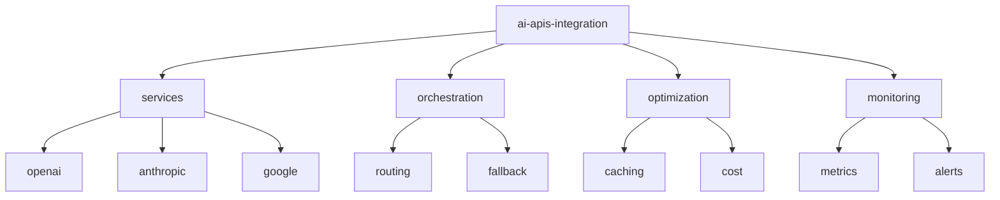

# AI APIs Integration 🔌

[](https://www.python.org/downloads/)
[](https://openai.com/)
[](https://langchain.org)
[](https://fastapi.tiangolo.com/)
[](LICENSE)

> Production-ready integrations with major AI services and APIs. Demonstrating efficient orchestration and implementation of various AI services in real-world applications.

[Features](#features) • [Installation](#installation) • [Quick Start](#quick-start) • [Documentation](#documentation) • [Contributing](#contributing)

## 📑 Table of Contents
- [Features](#features)
- [Project Structure](#project-structure)
- [Prerequisites](#prerequisites)
- [Installation](#installation)
- [Quick Start](#quick-start)
- [Documentation](#documentation)
  - [Integrations](#integrations)
  - [Performance](#performance)
  - [Cost Optimization](#cost-optimization)
- [Contributing](#contributing)
- [Versioning](#versioning)
- [Authors](#authors)
- [Citation](#citation)
- [License](#license)
- [Acknowledgments](#acknowledgments)

## ✨ Features
- Multi-service AI orchestration
- Intelligent fallback strategies
- Rate limiting and caching
- Cost optimization techniques
- Production monitoring tools

## 📁 Project Structure



<details>
<summary>Click to expand full directory structure</summary>

```plaintext
ai-apis-integration/
├── services/          # Service integrations
│   ├── openai/       # OpenAI integration
│   ├── anthropic/    # Anthropic integration
│   └── google/       # Google AI integration
├── orchestration/     # Service orchestration
│   ├── routing/      # Request routing
│   └── fallback/     # Fallback strategies
├── optimization/      # Optimization tools
├── monitoring/        # Monitoring systems
├── tests/            # Unit tests
└── README.md         # Documentation
```
</details>

## 🔧 Prerequisites
- Python 3.8+
- Valid API keys for services
- Redis (for caching)
- Docker (optional)

## 📦 Installation

```bash
# Clone repository
git clone https://github.com/BjornMelin/ai-apis-integration.git
cd ai-apis-integration

# Create environment
python -m venv venv
source venv/bin/activate

# Install dependencies
pip install -r requirements.txt

# Set up environment variables
cp .env.example .env
# Edit .env with your API keys
```

## 🚀 Quick Start

```python
from ai_integration import services, optimization

# Initialize service orchestrator
orchestrator = services.AIOrchestrator(
    providers=["openai", "anthropic"],
    cache_enabled=True
)

# Configure cost optimization
cost_manager = optimization.CostManager(
    budget_limit=100,
    optimization_level="aggressive"
)

# Make API request with automatic optimization
response = orchestrator.process_request(
    prompt="Generate a business analysis",
    cost_manager=cost_manager,
    fallback_enabled=True
)
```

## 📚 Documentation

### Integrations

| Service | Features | Latency | Cost/1K Tokens |
|---------|----------|---------|----------------|
| OpenAI | GPT-4, Embeddings | 500ms | $0.03 |
| Anthropic | Claude, Analysis | 600ms | $0.02 |
| Google | PaLM, Vision | 450ms | $0.01 |

### Performance
- Intelligent request routing
- Response caching
- Rate limit management
- Error handling

### Cost Optimization

| Strategy | Savings | Impact |
|----------|---------|---------|
| Smart Routing | 30% | Minimal |
| Caching | 45% | None |
| Batch Processing | 25% | +100ms Latency |

## 🤝 Contributing
- [Contributing Guidelines](CONTRIBUTING.md)
- [Code of Conduct](CODE_OF_CONDUCT.md)
- [Development Guide](DEVELOPMENT.md)

## 📌 Versioning
We use [SemVer](http://semver.org/) for versioning. For available versions, see the [tags on this repository](https://github.com/BjornMelin/ai-apis-integration/tags).

## ✍️ Authors
**Bjorn Melin**
- GitHub: [@BjornMelin](https://github.com/BjornMelin)
- LinkedIn: [Bjorn Melin](https://linkedin.com/in/bjorn-melin)

## 📝 Citation
```bibtex
@misc{melin2024aiapisintegration,
  author = {Melin, Bjorn},
  title = {AI APIs Integration: Production-Ready AI Service Orchestration},
  year = {2024},
  publisher = {GitHub},
  url = {https://github.com/BjornMelin/ai-apis-integration}
}
```

## 📄 License
This project is licensed under the MIT License - see the [LICENSE](LICENSE) file for details.

## 🙏 Acknowledgments
- OpenAI team
- Anthropic developers
- LangChain community
- FastAPI developers

---
Made with 🔌 and ❤️ by Bjorn Melin
